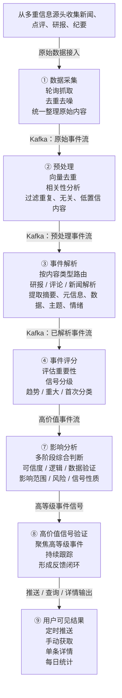

# Event Intelligence

## 结构图

## 简介

Event Intelligence 是一套面向用户的事件情报能力，帮助您持续接收重要事件、快速理解事件核心结论，并在需要时进一步查看某条事件的完整分析。

它适合用来跟踪某个主题、行业或方向的动态变化。您既可以让系统按固定频率持续推送，也可以手动拉取最近一段时间内的新事件。

---

## 它能为您做什么

这套能力主要提供三类服务：

### 1. 定时事件推送

您可以设定一个关键词或主题，例如：

- AI
- 半导体
- 机器人
- 新能源

系统会按设定的时间间隔，自动为您检索最近的新事件，并将整理后的结果推送给您。

如果当前时间窗口内没有新事件，系统会自动静默跳过，不会用空消息打扰您。

---

### 2. 手动获取最新事件

如果您不想持续推送，也可以随时主动查看最近一段时间内的新事件。

例如，您可以关注：

- 最近 5 分钟的新事件
- 最近 1 小时的新事件
- 某个特定主题下的最新动态

这样更适合临时查看或快速巡检。

---

### 3. 查看单条事件详情

当您对某条推送内容感兴趣时，可以继续深入查看它的完整分析。

系统支持：

- 按序号查看详情
- 按标题关键词回看某条事件
- 从推送摘要继续下钻到更完整的分析内容

这意味着您不用先看很长的报告，而是可以先浏览摘要，再决定是否继续深入。

---

## 您会看到什么样的结果

系统给您的结果通常不是原始数据，而是经过整理后的事件情报。

每条事件通常会包含这些部分：

- 事件标题
- 发布时间
- 信号等级
- 一句话总结
- 事件摘要

如果您继续查看详情，系统还会进一步提供更完整的分析结果，帮助您理解这条事件为什么值得关注、影响可能落在哪里，以及它的意义属于短期波动还是更长期的变化。

---

## 事件是怎么被整理出来的

从用户视角看，您看到的是一条条已经整理好的事件结论；从流程上看，系统背后会经过几步处理：

1. 先从多个来源采集事件、报告或资讯
2. 对重复内容和低相关内容做筛选
3. 把原始内容解析成结构化事件
4. 对事件的重要性和影响进行进一步判断
5. 再把结果整理成适合阅读的摘要与详情

也就是说，您看到的并不是未经处理的原始资讯，而是经过筛选、归纳和结构化后的输出。

---

## 为什么它适合持续跟踪

这套能力的重点不是“把所有信息都推给您”，而是“尽量把值得看的内容整理后再给您”。

因此它更适合以下场景：

- 您想长期跟踪某个主题
- 您希望减少低质量资讯干扰
- 您想先看摘要，再决定是否继续深入
- 您希望重要事件能够持续进入同一个工作流中，而不是零散地到处查看

---

## 使用方式

您通常可以这样使用它：

### 开始推送

您告诉系统想关注什么，以及希望多久接收一次更新。

例如：

- 请开始推送 AI 事件
- 每 15 分钟推送一次半导体相关事件

---

### 调整推送设置

在使用过程中，您可以随时修改：

- 推送频率
- 关注主题
- 每次返回的事件数量

这样可以让推送节奏更贴近您的实际需求。

---

### 查看详情

如果某条事件引起了您的兴趣，您可以继续说：

- 第 2 条详细看看
- 看看刚才那条关于算力的事件

系统会根据最近一次推送记录，为您展开对应事件的完整分析内容。

---

### 停止推送

如果您暂时不想继续接收更新，也可以随时关闭。

关闭后，相关的定时推送和每日统计会一并停止，避免继续占用注意力。

---

## 每日统计

除了定时推送外，系统还支持每日事件统计。

它会定期汇总最近一段时间内的重要事件数量，尤其是高等级事件的变化情况，帮助您从“单条事件”切换到“整体事件密度”的视角。

这种统计更适合用来回答：

- 最近一天市场上有没有显著增多的重要事件
- 某个主题是不是正在明显升温
- 当前更值得重点关注的是密集催化，还是零散噪音

---

## 适用边界

这套能力更适合做：

- 主题跟踪
- 事件监控
- 情报整理
- 决策前的信息辅助

它不等同于：

- 自动交易系统
- 实时下单系统
- 对结果的收益承诺

更准确地说，它是一套“帮助您把事件看清楚、把重点挑出来、再决定是否深入”的情报工具。

---

## 适合谁使用

这套能力尤其适合：

- 需要长期跟踪某个行业或主题的用户
- 希望减少资讯噪音、提高阅读效率的用户
- 更关注事件演化和逻辑变化，而不只是单条新闻标题的用户
- 需要把“接收事件”和“查看详情”放在同一条工作流里的用户

如果您只是想偶尔查一下最新事件，可以用手动获取。

如果您希望持续跟踪某个方向，更适合开启定时推送并结合详情查看使用。
